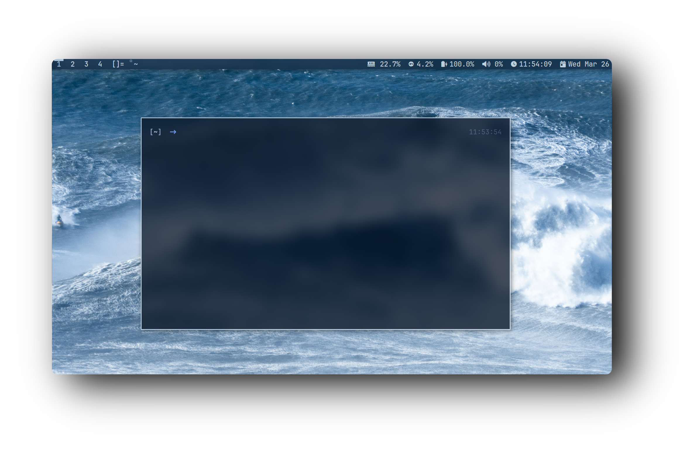
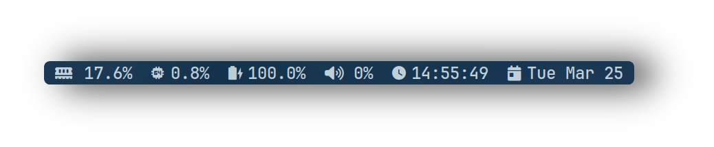

  <h2 style="font-size: 54px;">
    <strong>
      <a href="https://suckless.org/" style="text-decoration: none; color: inherit;">
        
        Dynamic Window Manager
      </a>
    </strong>
  </h2>

  

    
<strong>🚀 Resource Efficiency</strong>

    
Optimized for performance and minimal resource usage. On average, my setup consumes between <strong>250 MB and 400 MB of RAM</strong>, depending on the installed packages and background services. This lightweight configuration maximizes system resources for essential tasks and keeps everything running smoothly.

<h1>

<h1>
      

 

  
##### ⚙️ Applications
- **Window Manager** :bento: [DWM](https://dwm.suckless.org/)
- **Application Launcher** :rocket: [Dmenu](https://tools.suckless.org/dmenu/)
- **Terminal Emulator** :leaves: [KITTY](https://github.com/kovidgoyal/kitty)
- **Shell** :shell: [Fish](https://fishshell.com/)
- **Compositor** :shaved_ice: [Picom](https://github.com/yshui/picom)
- **Terminal with Graphics** :rocket: [ST](https://tools.suckless.org/st/)

## 🔑 Key Bindings

- **$mod+q** – KILL WINDOW  
- **$mod+Return** – KITTY
- **$mod+f** – FIREFOX  
- **$mod+d** – DMENU  
- **$mod+e** – PCMANFM

# DWM - PANEL
### A custom made Python-based panel for dwm

<h1>
      

 

#### ⚙️ 𝙁𝙚𝙖𝙩𝙪𝙧𝙚𝙨

  -  𝗗𝗲𝘃𝗲𝗹𝗼𝗽𝗲𝗱 𝗳𝗿𝗼𝗺 𝗦𝗰𝗿𝗮𝘁𝗰𝗵 ⚙️
  -  𝗪𝗿𝗶𝘁𝘁𝗲𝗻 𝗶𝗻 𝗣𝘆𝘁𝗵𝗼𝗻 🐍
  -  𝗟𝗶𝗴𝗵𝘁𝘄𝗲𝗶𝗴𝗵𝘁 𝗮𝗻𝗱 𝗙𝗮𝘀𝘁 ⚡

## :octocat: ‎ <samp>HI THERE! THANKS FOR DROPPING BY!</samp>
